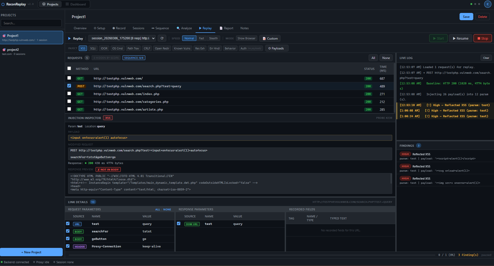

    

    
    
    
    

  <a href="#features">Features</a> •
  <a href="#installation">Installation</a> •
  <a href="https://github.com/yourusername/reconreplay/issues">Report a Bug</a> •
  <a href="https://github.com/yourusername/reconreplay/issues">Request a Feature</a>

**ReconReplay** is an advanced desktop web security testing tool for bug bounty hunters and penetration testers. It captures real browser sessions and replays them automatically with active payload injection — detecting XSS, SQL Injection, IDOR, Path Traversal, CRLF, Open Redirect, and more.

All session data stays on your machine. No traffic is uploaded to external servers.

> **Beta:** All features are fully unlocked during the beta period. [Download now](#installation) and get free access to every Pro feature.

---

# Features

- **Record** — Launches a real Chromium browser through a built-in proxy. Every HTTP/HTTPS request and DOM interaction is captured automatically.
- **Replay** — Re-runs recorded sessions with payload injection across 10+ vulnerability profiles in both headless HTTP mode and live visual browser mode.
- **Detect** — Compares payload responses against a clean baseline to surface reflected XSS, SQLi errors, time delays, redirect chains, and more.
- **Analyse** — Inspect every captured request and response, extract parameters from URLs, form bodies, hidden fields, and DOM links, and view passive findings.
- **Report** — Export findings as Markdown, HTML, or JSON — ready for HackerOne, Bugcrowd, or internal reports.
- **Local-first** — Everything stored in SQLite on your machine. Supabase is used only for identity — not your traffic.

---

# Installation

ReconReplay is designed for easy installation on Windows and Linux.

- First, [download](https://github.com/yourusername/reconreplay/releases) the package for your platform.
- Run the installer and launch ReconReplay — the mitmproxy CA certificate is installed automatically on first launch.
- Create a free account, start a new session, and begin recording.

### Windows Installer

1. Download the latest **`ReconReplay Setup 2.0.0.exe`** from the [Releases](https://github.com/yourusername/reconreplay/releases) page.
2. Run the installer — you can choose the installation directory when prompted.
3. Launch **ReconReplay** from the Start Menu or desktop shortcut.
4. Sign in or create a free account on the login screen.

> The mitmproxy CA certificate is installed automatically on first launch. A UAC prompt may appear — this is required for HTTPS traffic interception to work.

**No prerequisites required.** Node.js, Python, and all dependencies are bundled inside the installer.

---

# Vulnerability Profiles

| Profile | What It Detects |
|---|---|
| XSS | Payload reflection (6 encoding variants) + `alert()` confirmation via Playwright dialog handler |
| SQLi | DB error strings, time-based delays (>4s), boolean response differences |
| IDOR | Adjacent numeric IDs returning 200 with significantly different response body |
| OS Command Injection | Command output strings or response time >9s |
| Path Traversal | `/etc/passwd` or Windows `hosts` content in response |
| CRLF Injection | Injected canary header present in response |
| Open Redirect | 3xx redirect to injected domain |
| Known Vulnerabilities | Struts / Spring / Log4Shell error patterns |
| Resource Exhaustion | 500 errors or response time >10s from large payloads |
| Error Handling | Stack traces or verbose exceptions absent in baseline |

---

# Contributing

You can help by:

- Reporting [bugs](https://github.com/yourusername/reconreplay/issues)
- Requesting new [features](https://github.com/yourusername/reconreplay/issues)
- Submitting custom payload profiles to `python/payloads/custom/`
- Improving the [documentation](https://github.com/yourusername/reconreplay/wiki)
- Writing blog posts, tutorials, or write-ups using ReconReplay

---

# License

ReconReplay is currently in private beta. License terms will be published alongside the first public release.
